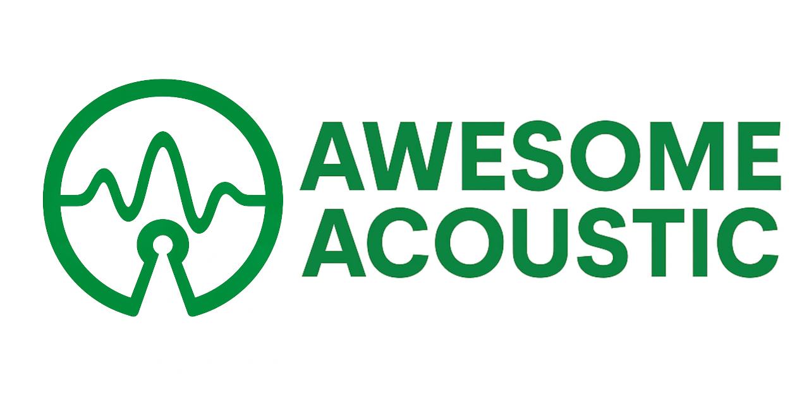

A list of awesome open-source Acoustic packages and resources.

> [!IMPORTANT]
> Contributions are more than welcome
- [General Tools](#general-tools)
- [Signal Processing](#signal-processing)
- [Room Acoustics](#room-acoustics)
- [Environment](#environment)
- [FEM, Materials, Vibrations](#fem-materials-vibrations)
- [Soundscape](#soundscape)
- [Bioacoustics](#bioacoustics)
- [Databases](#databases)
- [Music](#music)
- [Health](#health)
- [Education](#education)
- [AeroAcoustics](#aeroacoustics)
- [AI, Machine Learning](#ai-machine-learning)
- [Books](#books)
- [Hardware](#hardware)

## General Tools

| Package | Description | Language |
|---------|-------------|----------|
| [Acoustic Toolbox](https://github.com/Universite-Gustave-Eiffel/acoustic-toolbox) | A Python library for acousticians. | Python |
| [MoSQITo](https://github.com/Eomys/MoSQITo) | MoSQITo is a unified and modular development framework of key sound quality metrics favoring reproducible science and efficient shared scripting among engineers, teachers and researchers community. | Python |
| [Pyfar](https://github.com/pyfar/pyfar) | python package for acoustics research | Python |
| [PyTTA](https://github.com/PyTTaMaster/PyTTa) | Python in Technical Acoustics and Vibration | Python |
| [friture](https://github.com/tlecomte/friture) | Real-time audio visualizations (spectrum, spectrogram, etc.) | Python |
| [ITA Toolbox](https://www.ita-toolbox.org/) | An open source MATLAB toolbox for acoustics developed by the Institute of Technical Acoustics of the RWTH Aachen University |  |
| [k-Wave](https://github.com/ucl-bug/k-wave) | A MATLAB toolbox for the time-domain simulation of acoustic wave fields | MATLAB |
| [k-Wave-python](https://github.com/waltsims/k-wave-python) | A Python interface to k-Wave GPU accelerated binaries | Python |
| [Mesh2HRTF](https://github.com/Any2HRTF/Mesh2HRTF) | Open software for the numerical calculation of head-related transfer functions | C++ |
| [ObsPy](https://github.com/obspy/obspy) | ObsPy: A Python Toolbox for seismology/seismological observatories. | Python |

## Signal Processing

| Package | Description | Language |
|---------|-------------|----------|
| [PyOctaveBand](https://github.com/jmrplens/PyOctaveBand) | [Python3] Octave-Band and Fractional Octave-Band filter. For signal in time domain.  | Python |
| [Acoular](https://github.com/acoular/acoular) | Acoular - Acoustic testing and source mapping software | Python |
| [CleanTiPy](https://github.com/Universite-Gustave-Eiffel/CleanTiPy) | An open-source implementation of CLEAN-T acoustic imaging technique | Python |
| [paderwasn](https://github.com/fgnt/paderwasn) | Paderwasn is a collection of methods for acoustic signal processing in wireless acoustic sensor networks (WASNs). | Python |

## Room Acoustics

| Package | Description | Language |
|---------|-------------|----------|
| [Pyroomacoustics](https://github.com/LCAV/pyroomacoustics) | Pyroomacoustics is a package for audio signal processing for indoor applications. It was developed as a fast prototyping platform for beamforming algorithms in indoor scenarios. | Python |
| [DEISM](https://github.com/audiolabs/DEISM) | Diffraction Enhanced Image source method | C++ |
| [Virtual Acoustics](https://www.virtualacoustics.org/) | creates audible sound from a purely virtual situation |  |
| [I-Simpa](https://github.com/Universite-Gustave-Eiffel/I-Simpa) | An Open Source software for 3D sound propagation modelling | C++ |
| [edg-acoustics](https://github.com/Building-acoustics-TU-Eindhoven/edg-acoustics) | Wave-based room acoustic modeling package with the DG method | Python |
| [CHORAS](https://github.com/Building-acoustics-TU-Eindhoven/CHORAS) | The Community Hub for Open-source Room Acoustics Software (CHORAS) | None |
| [Diffusion](https://github.com/Building-acoustics-TU-Eindhoven/Diffusion) | This is a diffusion equation model for room acoustics predictions, developed in Python. | Python |
| [EAVR-v2](https://github.com/Building-acoustics-TU-Eindhoven/EAVR-v2) | The Eindhoven Acoustic Virtual Reality (EAVR) Toolkit, interactively teach students principles in the field of acoustics, by changing various aspects of the VR environment | C# |
| [Chalmers Auralization Toolbox](https://github.com/AppliedAcousticsChalmers/auralization-toolbox) | The Chalmers Auralization Toolbox | MATLAB |

## Environment

| Package | Description | Language |
|---------|-------------|----------|
| [NoiseModelling](https://github.com/Universite-Gustave-Eiffel/NoiseModelling) | A open-source model to compute noise maps. | Java |
| [NoiseCapture](https://github.com/Universite-Gustave-Eiffel/NoiseCapture) | Android App dedicated to the measurement of environmental noise. | Java |
| [Code_Tympan](https://gitlab.com/tympan/code_tympan) | Code_TYMPAN is a software developed by EDF R&D to simulate noise in industrial sites. |  |
| [HRISK](https://gitlab.com/jtagusari/hrisk-noisemodelling) | This is a QGIS plugin, which implements NoiseModelling and helps estimate the health risks posed by (road traffic) noise. |  |
| [Ono Sensor](https://github.com/Universite-Gustave-Eiffel/Rail4Earth) | OnoSensor (Open Noise Sensor) empowering communities through complete noise monitoring — From acquisition to distributed networked storage and visualization. | JavaScript |
| [Sparrowpy](https://github.com/sparrow-acoustics/sparrowpy) | Sound Propagation with Acoustic Radiosity for Realistic Outdoor Worlds | Python |

## FEM, Materials, Vibrations

| Package | Description | Language |
|---------|-------------|----------|
| [OURS](https://github.com/rivm-syso/OURS) | Dutch calculation method for railway vibrations | Pascal |
| [Code_Aster](https://gitlab.com/codeaster/src) | Code_Aster is a general-purpose finite element software package for numerical simulation in structural mechanics, heat transfer, and fluid dynamics. |  |
| [FEniCS](https://github.com/FEniCS/dolfinx) | Next generation FEniCS problem solving environment | C++ |
| [pyOMA2](https://github.com/dagghe/pyOMA2) | Python module for conducting operational modal analysis | Python |
| [bempp-cl](https://github.com/bempp/bempp-cl) | A fast Python based just-in-time compiling boundary element library | Python |

## Soundscape

| Package | Description | Language |
|---------|-------------|----------|
| [Soundscapy](https://github.com/MitchellAcoustics/Soundscapy) | A python library for soundscape assessments | Python |
| [scikit-maad](https://github.com/scikit-maad/scikit-maad) | Open-source and modular toolbox for quantitative soundscape analysis in Python | Python |

## Bioacoustics

| Package | Description | Language |
|---------|-------------|----------|
| [BirdNET](https://github.com/kahst/BirdNET-Analyzer) | BirdNET analyzer for scientific audio data processing. | Python |
| [BirdNET-Pi](https://github.com/Nachtzuster/BirdNET-Pi) | A realtime acoustic bird classification system for the Raspberry Pi 5, 4B 3B+ 0W2 and more. Built on the TFLite version of BirdNET. | PHP |
| [PAMGuard](https://github.com/PAMGuard/PAMGuard) | Detection, Classification, and Localisation of marine mammal and other bioacoustic signals | Java |
| [AudioMoth](https://github.com/OpenAcousticDevices/AudioMoth-Project) | A minimal project on which all AudioMoth firmware can be built. | C |
| [vak](https://github.com/vocalpy/vak) | A neural network framework for researchers studying acoustic communication | Python |
| [warbleR](https://github.com/maRce10/warbleR) | streamline acoustic analysis in R | R |
| [Acoupi](https://github.com/acoupi/acoupi) | Python toolkit to implement bioacoustics classifier on embedded systems. | Python |
| [Crowsetta](https://github.com/vocalpy/crowsetta) | A tool to work with any format for annotating animal sounds | Python |

## Databases

| Package | Description | Language |
|---------|-------------|----------|
| [Soundata](https://github.com/soundata/soundata) | Python library for downloading, loading & working with sound datasets | Python |
| [DCASE](https://github.com/DCASE-REPO/dcase_datalist) | Collection of DCASE related datasets | HTML |
| [xeno-canto](https://xeno-canto.org/) | A community-driven site for sharing and discovering bird sounds |  |
| [The International Soundscape Database](https://zenodo.org/records/10672568) | The International Soundscape Database contains the results of a series of soundscape assessment campaigns carried out across Europe and China. |  |
| [room-impulse-responses](https://github.com/RoyJames/room-impulse-responses) | A list of publicly available room impulse response datasets and scripts to download them.  | Shell |
| [BirdSet](https://github.com/DBD-research-group/BirdSet) | A benchmark dataset collection for bird sound classification | Jupyter Notebook |

## Music

| Package | Description | Language |
|---------|-------------|----------|
| [librosa](https://github.com/librosa/librosa) | Python library for audio and music analysis | Python |
| [pyAudioAnalysis](https://github.com/tyiannak/pyAudioAnalysis) | Python Audio Analysis Library: Feature Extraction, Classification, Segmentation and Applications | Python |
| [madmom](https://github.com/CPJKU/madmom) | Python audio and music signal processing library | Python |
| [audioFlux](https://github.com/libAudioFlux/audioFlux) | A library for audio and music analysis, feature extraction. | C |

## Health

| Package | Description | Language |
|---------|-------------|----------|
| [tascar](https://github.com/gisogrimm/tascar/) | toolbox for acoustic scene creation and rendering | C++ |
| [openMHA](https://github.com/HoerTech-gGmbH/openMHA) | The open Master Hearing Aid (openMHA) | C |
| [Cape4all](https://github.com/HoerTech-gGmbH/Cape4all) | Open Hardware Multichannel Sound Interface for Hearing Aid Research on Beaglebone Black | None |

## Education

| Package | Description | Language |
|---------|-------------|----------|
| [Acoucou](https://acoucou.org/) | A platform for learning about acoustics |  |
| [SoftwareProfesionalAcustica](https://github.com/maprieto/SoftwareProfesionalAcustica) | Jupyter notebooks de la asignatura de Software Profesional en Acústica del Máster de Matemática Industrial (M2i) | Jupyter Notebook |
| [AcousticsML](https://github.com/RAMshades/AcousticsML) | Tutorial on using machine learning for acoustics. This tutorial covers a wide range of machine learning approaches for acoustic applications. | Jupyter Notebook |

## AeroAcoustics

| Package | Description | Language |
|---------|-------------|----------|
| [AeroAcoustics.jl](https://github.com/1oly/AeroAcoustics.jl) | A Julia package for Aeroacoustics | Julia |
| [WAPE](https://github.com/Universite-Gustave-Eiffel/WAPE) | Wide Angle Parabolic Equation model with arbitrary Mach number | MATLAB |

## AI, Machine Learning

| Package | Description | Language |
|---------|-------------|----------|
| [PANN](https://github.com/qiuqiangkong/audioset_tagging_cnn) | Pretrained audio neural networks (PANNs) for audio pattern recognition | Python |
| [YamNet](https://github.com/antonyharfield/tflite-models-audioset-yamnet) | A TFLite-compatible fork of YAMNet from tensorflow/models | Jupyter Notebook |
| [CLAP](https://github.com/microsoft/CLAP) | Learning audio concepts from natural language supervision | Python |
| [PANN with 1/3 octaves](https://github.com/modantailleur/paperSoundscapeSourceClassification) | PANN with 1/3 octaves for soundscape source classification | HTML |
| [BEATs](https://github.com/microsoft/unilm/tree/master/beats) | Large-scale Self-supervised Pre-training Across Tasks, Languages, and Modalities | Python |

## Books

| Package | Description | Language |
|---------|-------------|----------|
| [Understanding Acoustics](https://library.oapen.org/handle/20.500.12657/42912) | An Experimentalist’s View of Sound and Vibration |  |
| [Nonlinear Acoustics](https://link.springer.com/book/10.1007/978-3-031-58963-8) | Introductory text on the theory of nonlinear acoustics authored by experts on their respective topics |  |
| [Aviation Noise Impact Management](https://link.springer.com/book/10.1007/978-3-030-91194-2) | A view into the state-of-the-art research on aviation noise and related annoyance |  |
| [Exploring Animal Behavior Through Sound: Volume 1](https://link.springer.com/book/10.1007/978-3-030-97540-1) | Introduces standard terminology, procedures, equipment, and analysis tools for animal bioacoustic studies. |  |
| [Exploring Animal Behavior Through Sound: Volume 2](https://link.springer.com/book/10.1007/978-3-031-83460-8) | Organized into nine chapters by taxonomy — invertebrates, insects, amphibians, reptiles, fishes, birds, and mammals (subterranean, terrestrial, and marine) — it delves into sound production, sound reception, sound function, and the impacts of noise on these creatures. |  |
| [Marine Mammal Acoustics in a Noisy Ocean](https://link.springer.com/book/10.1007/978-3-031-77022-7) | Explores the fundamentals of ocean acoustics, revealing the intricate sources of underwater noise that challenge marine life |  |
| [Beginning DYNA[mics] with code_aster](https://www.jean-pierre-aubry.ouvaton.org/files/Beginning_DYNAmics_with_code_aster1.1.2-20230119.pdf) | A practical introduction to mechanical DYNAmic [misc]ellaneous using code_aster |  |

## Hardware

| Package | Description | Language |
|---------|-------------|----------|
| [acoustic-camera](https://github.com/rabeaifeanyi/acoustic-camera) | This project uses Acoular to implement an acoustic camera for the miniDSP UMA-16 microphone array, with optional integration of transformer model results for enhanced audio analysis. | Python |
